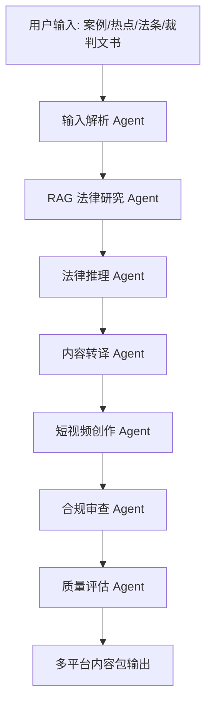

# 快律 KuaiLv Legal Content Agent Skill

「快律」是一个面向法律自媒体、律师助理、普法运营团队和法律营销团队的 AI Agent Skill / 工作流原型。项目目标是把 **法律材料理解 → 法律依据检索 → 法律推理 → 内容生成 → 合规审查 → 多平台分发** 整合成一个可复用的多 Agent 工作流。

> 本项目用于展示 AI Agent 工作流能力、RAG 知识库接入思路、长链推理结构和内容合规审查能力。项目输出不构成正式法律意见，实际业务使用前应由具备资质的法律从业者复核。

## 1. 项目解决的核心痛点

法律内容生产存在四类高频痛点：

1. **材料理解成本高**：法律热点、裁判文书、咨询记录、法条原文通常篇幅较长、结构复杂，普通内容创作者难以快速提取争议焦点、法律关系和关键事实。
2. **法律依据检索慢**：人工匹配法律法规、司法解释、典型案例和裁判规则耗时较高，且容易遗漏适用边界。
3. **内容转化难**：法律内容既要准确严谨，又要适合短视频传播，需要在专业性、通俗性、完播率之间取得平衡。
4. **合规风险高**：法律类短视频容易出现夸大服务效果、绝对化结论、误导性建议、隐私泄露、标题党、情绪煽动和平台违规表达。

「快律」通过多 Agent 协作，将法律研究和内容生产流程标准化，降低内容生产成本，同时提升输出的一致性和合规性。

## 2. 核心能力

用户输入一个法律热点、裁判文书摘要、咨询记录、法条或新闻材料后，系统输出完整内容包：

- 案件事实梳理
- 争议焦点提取
- 相关法律依据
- 法律分析结论
- 60 秒短视频口播稿
- 30 秒精简版口播稿
- 标题候选
- 封面文案
- 平台标签
- 评论区引导话术
- 合规风险提示
- 安全改写版本
- 输出质量评分

## 3. 多 Agent 工作流



### Agent 分工

| Agent | 作用 |
|---|---|
| 输入解析 Agent | 抽取主体、时间线、行为、证据、争议焦点和潜在法律关系 |
| RAG 法律研究 Agent | 检索法律法规、司法解释、典型案例、裁判规则和平台规则 |
| 法律推理 Agent | 基于事实和依据进行长链推理，判断责任划分、举证难点和风险边界 |
| 内容转译 Agent | 将专业法律分析改写为普通用户能理解的表达 |
| 短视频创作 Agent | 生成口播稿、标题、封面文案、标签和评论区互动话术 |
| 合规审查 Agent | 识别夸大承诺、误导性建议、隐私泄露、敏感表达和平台违规风险 |
| 质量评估 Agent | 检查法律依据完整性、逻辑闭合度、表达通俗度、传播钩子和合规处理结果 |

## 4. Token 使用需求说明

该项目具有明确的大上下文和多轮调用需求。单次任务通常需要处理较长文本，例如裁判文书、咨询记录、新闻报道、法条原文和平台规则；同时还需要多轮抽取、检索、推理、生成、改写、审查和评分。若接入 RAG 法律知识库，还需要拼接检索到的法律依据、案例摘要和平台规则上下文。

因此，一个完整任务通常包含：

1. 长文本输入解析；
2. RAG 检索上下文拼接；
3. 法律关系长链推理；
4. 多版本内容生成；
5. 合规审查与安全改写；
6. 质量评分与版本对比。

该流程需要较高 token plan 支持持续测试、批量生成、知识库接入和产品迭代。

## 5. 仓库结构

```text
kuailv-legal-content-agent-skill/
├── .skills/
│   └── kuailv-legal-content-agent/
│       └── SKILL.md
├── docs/
│   ├── architecture.md
│   ├── token_usage.md
│   └── evaluation_rubric.md
├── prompts/
│   ├── agent_roles.md
│   ├── compliance_check_prompt.md
│   └── system_prompt.md
├── workflows/
│   └── kuailv.workflow.json
├── examples/
│   ├── input_case.md
│   └── output_content_pack.md
├── logs/
│   └── sample_run_log.md
├── src/
│   └── kuailv_agent_demo.py
├── requirements.txt
├── README.md
└── LICENSE
```

## 6. 快速运行 Demo

```bash
pip install -r requirements.txt
python src/kuailv_agent_demo.py --input examples/input_case.md
```

当前 Demo 使用规则化流程模拟多 Agent 编排，方便展示工作流结构。实际生产环境可替换为 OpenAI、MiMo、DeepSeek、Claude、通义千问等模型 API，并接入向量数据库实现 RAG 检索。

## 7. 适用场景

- 法律短视频脚本生产
- 律师普法内容生产
- 法律营销素材生成
- 咨询案例内容化
- 裁判文书通俗化解读
- 法律内容发布前合规审查
- 多平台内容改写

## 8. 合规声明

本项目输出仅用于法律科普和内容创作辅助，不构成正式法律意见、诉讼策略或律师服务承诺。涉及具体案件时，应由执业律师结合完整证据材料进行独立判断。
